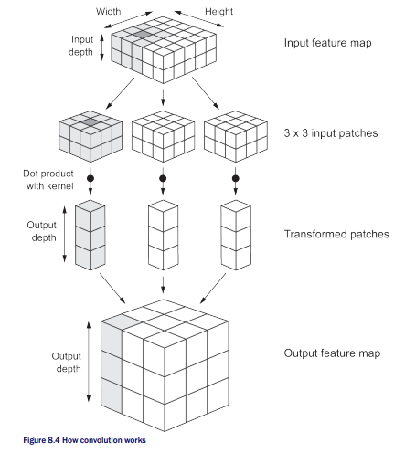
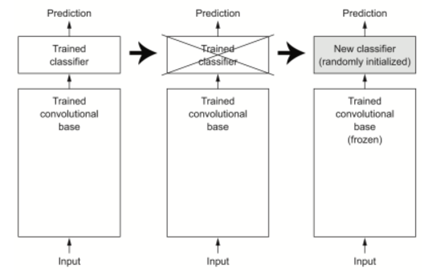
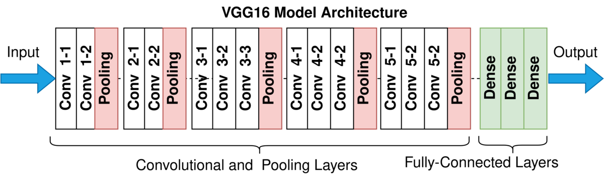
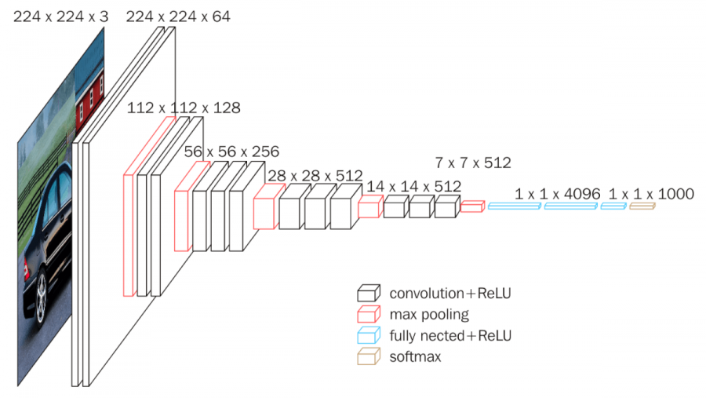
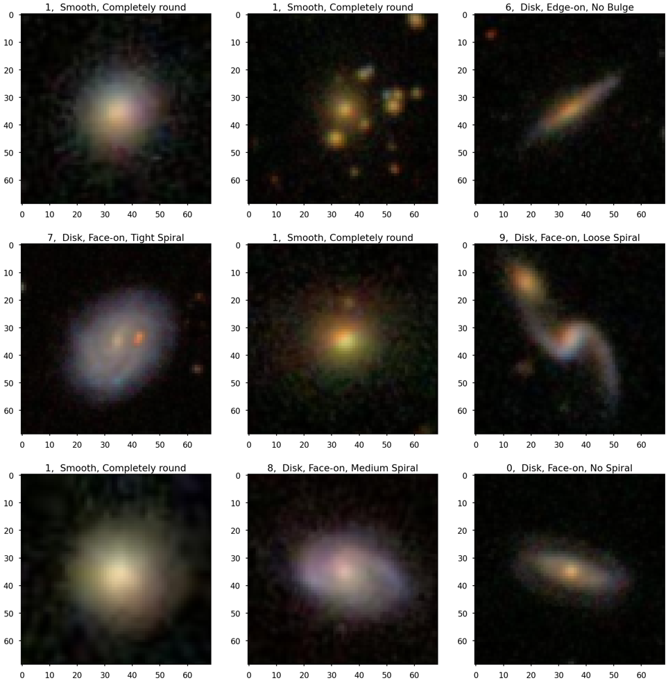

# galaxy_morphology_classification

Classifying galaxy morphologies using deep learning.

## Overview

Use a deep convolutional neural network [1] and transfer learning to classify images of galaxies by their morphology (smooth galaxy or spiral galaxy).

## References

[1] LeCun, Yann, Bernhard Boser, John S. Denker, Donnie Henderson, Richard E. Howard, Wayne Hubbard, and Lawrence D. Jackel. "Backpropagation applied to handwritten zip code recognition." Neural computation 1, no. 4 (1989): 541-551.

[2] Chollet, Francois. Deep learning with Python. Simon and Schuster, 2021.

[2] Simonyan, Karen, and Andrew Zisserman. "Very deep convolutional networks for large-scale image recognition." arXiv preprint arXiv:1409.1556 (2014).